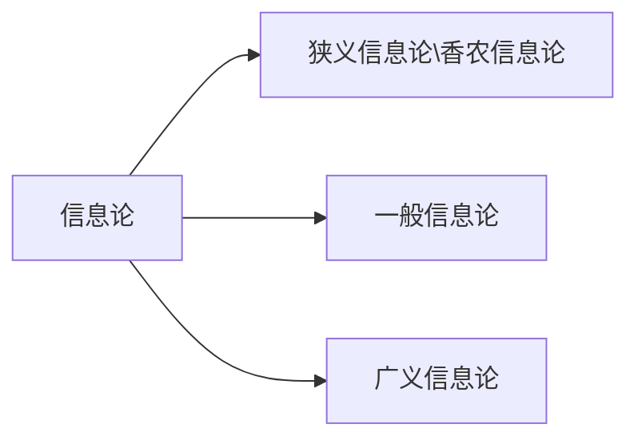

## 第一章

- 通信的数学理论  三个编码定理

- 信息论回答通信原理中的两个基本问题：

  - 数据的可压缩量(熵H)
  - 信道的传输率(信道容量C)

- 香农信息的度量

  - 自信息：消息的不确定性为该消息先验概率倒数的某一函数

  $$
  I(a_i)=log{\frac{1}{P(a_i)}}
  $$

  - 互信息：先验的不确定性减尚存的不确定性。

$$
I(a_i;b_i)=log{\frac{1}{P(a_i)}}-log{\frac{1}{P(a_i|b_i)}}  (log{\frac{1}{P(a_i|b_i)}}为后验概率)\\
在信道无干扰的情况下，I(a_i;b_i)=I(a_i)
$$

